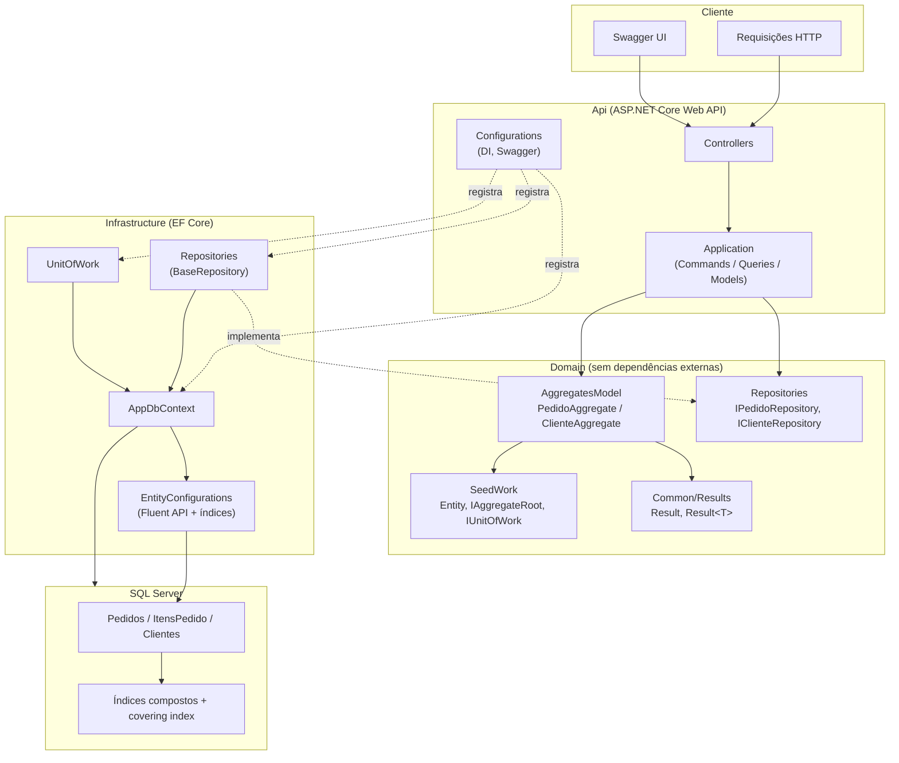

# System Design — High Performance Orders API

## Arquitetura em camadas

## Princípios seguidos

- **Domain independente**: não referencia EF Core, ASP.NET ou qualquer pacote externo — só `Repositories`/`SeedWork`/`Common` definidos internamente.
- **Infrastructure conhece o Domain, não o contrário**: `Infrastructure` implementa as interfaces (`IPedidoRepository`, `IUnitOfWork`) definidas em `Domain`.
- **Api orquestra**: Controllers finos, lógica de aplicação em `Application/Commands` e `Application/Queries`, DI centralizado em `Configurations`.
- **Leitura de alta performance não passa pelo Repository genérico**: os endpoints `slow`/`fast`/`benchmark` (próxima etapa) consultam o `AppDbContext` diretamente via `IQueryable`, para ter controle total de projeção, `AsNoTracking` e paginação — ver [index-strategy.md](index-strategy.md) quando criado.

## Fluxo de uma requisição de escrita (ex: criar Pedido)

1. `Controller` recebe o request e delega para um `Command`/`Handler` em `Api/Application/Commands`.
2. O handler usa `IPedidoRepository`/`IClienteRepository` (Domain) para manipular agregados e retorna `Result`/`Result<T>`.
3. `IUnitOfWork.SaveChangesAsync` persiste as mudanças via `AppDbContext`.
4. O Controller traduz o `Result` em uma resposta HTTP (200/400/422/500).
