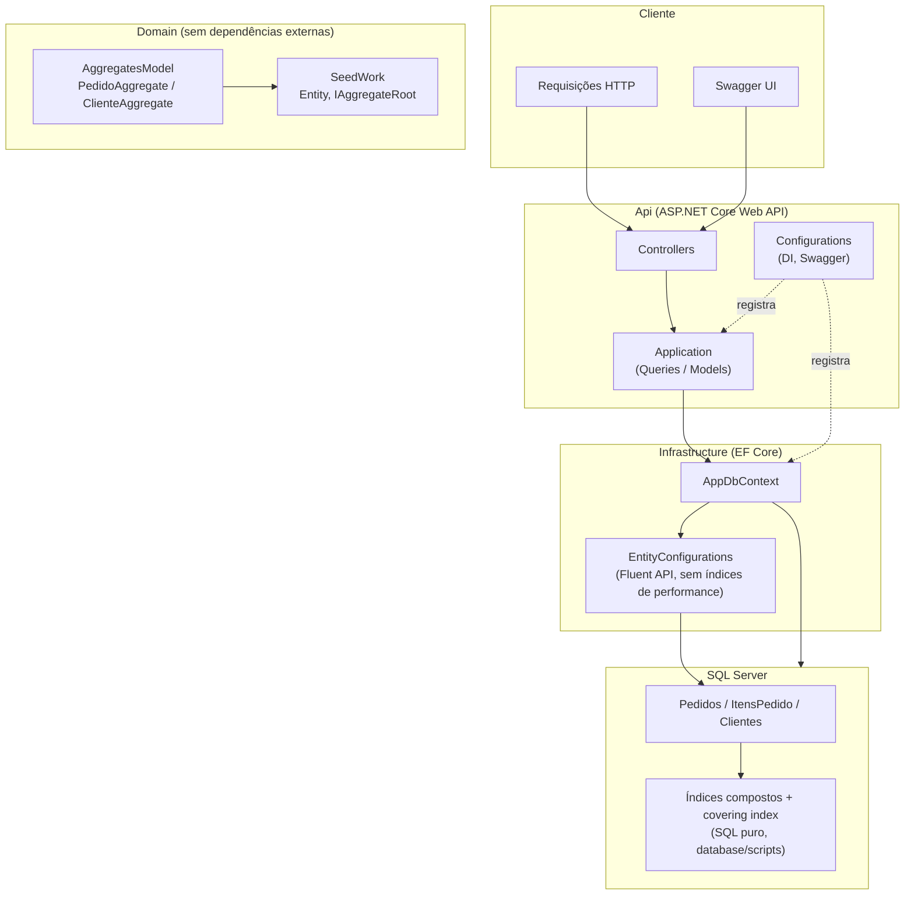

# System Design — High Performance Orders API

## Arquitetura em camadas

## Princípios seguidos

- **Domain independente**: não referencia EF Core, ASP.NET ou qualquer pacote externo — só `AggregatesModel`/`SeedWork` definidos internamente.
- **Api orquestra**: Controllers finos, lógica de leitura em `Application/Queries`, DI centralizado em `Configurations`.
- **Leitura de alta performance não passa por Repository genérico**: os endpoints `slow`/`fast`/`fast-dapper`/`benchmark` consultam o `AppDbContext` (ou SQL puro via Dapper) diretamente via `IQueryable`, para ter controle total de projeção, `AsNoTracking` e paginação — ver [index-strategy.md](index-strategy.md).
- **Sem abstração sem uso real**: este projeto chegou a ter `Repository`/`UnitOfWork`/`Result Pattern` no Domain/Infrastructure (padrão do `develop-flow`), mas como nenhum Command de escrita foi implementado, essas camadas nunca eram chamadas — foram removidas. Se/quando um endpoint de escrita (criar Pedido/Cliente) for implementado, essas peças voltam a fazer sentido, mas só quando houver uso real, não antes.

## O que existe hoje

Como o projeto é só leitura (endpoints de estudo de performance), o fluxo é direto:

1. `Controller` recebe o request e delega pra uma classe de `Application/Queries` (`IPedidoQueries` via EF Core, ou `IPedidoDapperQueries` via SQL puro).
2. A Query consulta `AppDbContext`/`SqlConnection` diretamente, projeta o resultado num Model (`Api/Application/Models`) e devolve.
3. O Controller retorna o Model como resposta HTTP.

Não há camada de escrita/Command neste projeto ainda.
